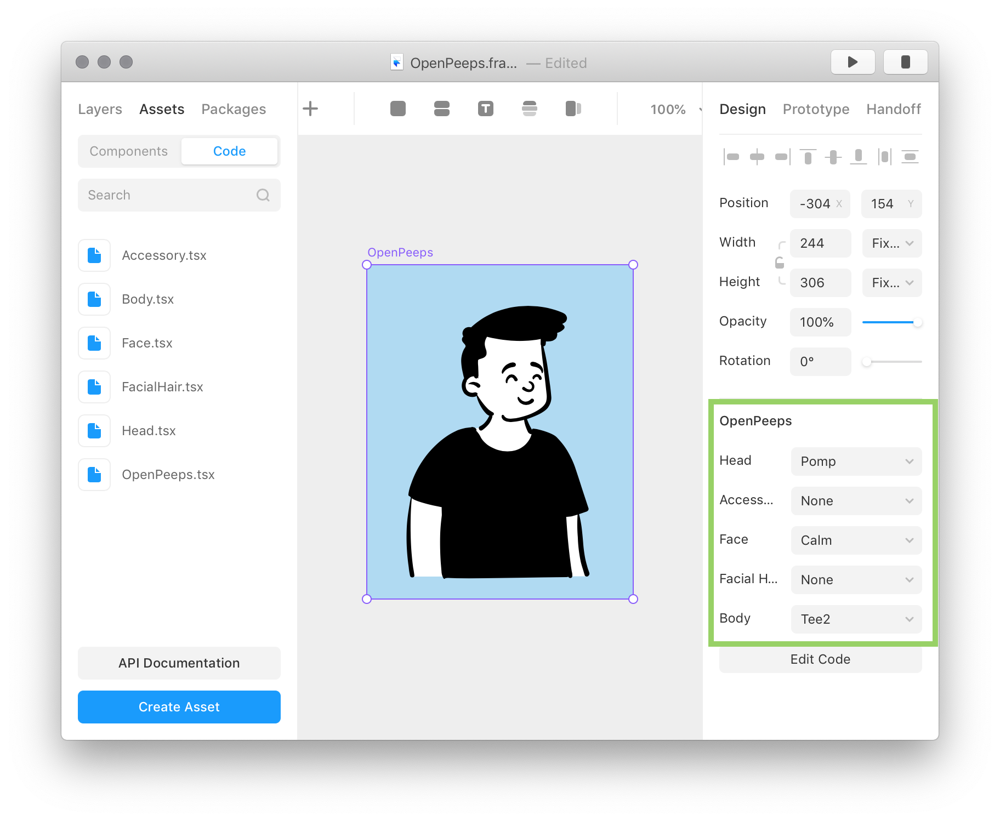

# OpenPeeps

[OpenPeeps.com](https://www.openpeeps.com/) inspired Framer X Component.

[OpenPeeps.com](https://www.openpeeps.com/) is a hand-drawn illustration library, free for use, that allows you to create a character by mixing multiple features (Posture, Body, Face, Head, Facial Hear and Accessories).

## Features

Currently, this component only supports the Bust version of OpenPeeps.

You can drag and drop the component to the canvas and change its properties

## TODO:

- [ ] Standing
- [ ] Sitting
- [ ] Colors

## Attributions

[Open Peeps](https://www.openpeeps.com/) by [Pablo Stanley](https://www.instagram.com/pablostanley/)